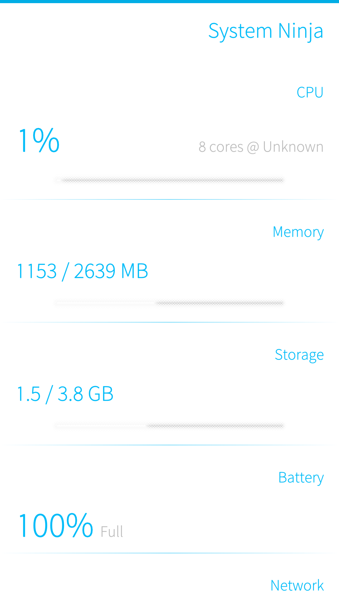

# System Ninja

> Native system monitor for Sailfish OS — built entirely on-device on a Sony Xperia XA2.



## Features

- **Live CPU monitoring** — real-time usage percentage with core count & frequency
- **Memory usage** — RAM used / total with progress bar
- **Storage stats** — internal storage usage tracking
- **Battery status** — capacity % and charging state
- **Network info** — WiFi connection status and IP address
- **Top processes** — 5 most CPU-intensive processes
- **Pull-to-refresh** — native Silica pull-down gesture
- **Auto-updating** — refreshes every 2 seconds

## Tech Stack

| Layer | Technology |
|-------|------------|
| UI | QML + Sailfish Silica |
| Backend | Python 3.13 via PyOtherSide |
| Runtime | qmlscene (Qt 5.6) |

## Why This Exists

This app was created directly on a Sailfish OS phone without a PC SDK — proving that a phone can build apps for itself in real-time using root access, Python, and QML.

## Installation

1. Install `qmlscene` and `qtchooser`:
   ```bash
   devel-su rpm -ivh qt5-qtdeclarative-qmlscene-*.rpm qtchooser-*.rpm
   ```

2. Clone this repo:
   ```bash
   git clone git@github.com:Andrew21P/system-ninja.git
   ```

3. Copy the desktop file:
   ```bash
   cp system-ninja/system-ninja.desktop ~/.local/share/applications/
   ```

4. Tap the icon in your app grid!

## File Structure

```
system-ninja/
├── main.qml      # Silica QML frontend
├── backend.py    # Python system stats backend
├── launch.sh     # Launcher script (sets QT_SELECT=5)
├── icon.png      # App icon
├── screenshot.png # App screenshot
└── README.md     # This file
```

## License

MIT — do whatever you want with it.
